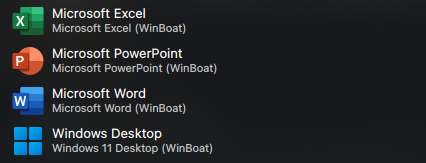

# WinBoat Runner

WinBoat Runner is a small Linux launcher for opening Windows applications or a
full Windows desktop from the Linux application menu or terminal **without
manually starting the Windows container first**. It starts an existing Windows
Docker container on demand, waits for its RDP service, launches an application
or desktop session through FreeRDP, and stops the container after it has been
idle.

This is an independent, unofficial community tool. It is not affiliated with,
endorsed by, sponsored by, or otherwise associated with WinBoat, Microsoft,
Docker, FreeRDP, KDE, or the Windows container images mentioned in this
documentation. All product and company names are trademarks of their
respective owners.

The project is intentionally a Bash/Python utility rather than a full
virtualization platform. It assumes that the Windows container, its shared
folder, and the Windows applications are already configured.

## Features

- **Dynamic lazy startup:** Starts the existing Docker container when an
  application is launched.
- **RDP readiness probe:** Sends a genuine RDP Connection Request PDU before
  starting FreeRDP, avoiding connection failures during Windows boot.
- **Path translation:** Maps Linux paths below `$HOME` to a Windows UNC share
  for opening documents from file managers such as Dolphin.
- **Idle shutdown:** Stops the container after no FreeRDP session has been
  running for the configured timeout.
- **Audio, microphone, and clipboard:** Passes these through FreeRDP using the
  local PulseAudio/PipeWire-compatible backend.
- **KDE Plasma integration:** Provides optional application launcher entries
  for Office applications and the Windows desktop.

## Requirements

This project is a launcher, not a Windows container installer. The Windows
guest, Windows applications, RDP service, and host-folder sharing must be
configured before using it.

- **Docker Engine:** Running and able to start the configured Windows container.
- **A Windows container:** For example, `dockurr/windows`, named `WinBoat` by
  default. It must expose RDP on container port `3389/tcp` and publish that
  port to the Linux host. A random host port is supported.
- **Hardware virtualization:** Windows containers such as `dockurr/windows`
  commonly require KVM (`/dev/kvm`), CPU virtualization enabled in firmware,
  and a Docker configuration that passes KVM through to the container. Follow
  the selected image's documentation; this repository does not configure KVM.
- **FreeRDP:** The runner prefers `xfreerdp3` and falls back to `xfreerdp`.
- **Python 3:** Used by the RDP readiness probe.
- **Bash and standard Linux tools:** `flock` (usually from `util-linux`),
  `pgrep` (usually from `procps-ng`), and common tools such as `awk`, `grep`,
  `head`, `install`, `sed`, `stat`, `tr`, and `sleep`.
- **Optional KDE Plasma:** Required only for the application launcher entries.
  The `kbuildsycoca6` or `kbuildsycoca5` command is optional and only refreshes
  KDE's application cache.

On Arch Linux:

```bash
sudo pacman -S docker freerdp python util-linux procps-ng
```

Package names vary by distribution. On Debian/Ubuntu the package is commonly
`freerdp2-x11` and Docker is commonly `docker.io`; on Fedora they are commonly
`freerdp` and `docker`. On Debian/Ubuntu, `python3`, `util-linux`, `procps`,
and the standard core utilities may need to be installed separately. On Fedora,
the corresponding process package is commonly `procps-ng`. Enable and start
Docker using your distribution's service manager, then verify the executables:

```bash
command -v docker python3 flock pgrep install
command -v xfreerdp3 || command -v xfreerdp
```

The user running the script must be allowed to use Docker (for example,
through the `docker` group or a rootless Docker setup). Docker must be running
before launching the runner. The configured container must already exist; the
script starts it, but does not create or configure it.

### Container and share checklist

Before using the runner, verify the image-specific setup:

1. The container exists and starts successfully.
2. RDP is enabled in the Windows guest.
3. Container port `3389/tcp` is published:

   ```bash
   docker port WinBoat 3389/tcp
   ```

4. The Windows guest can reach the host share configured as `HOST_SHARE`.
5. The Linux `$HOME` directory and that Windows share refer to the same files.
6. The configured `RDP_USER` exists in the Windows guest and can sign in.

`HOST_SHARE` is not automatically created by this project. Its value is
environment-specific: it must be the Windows UNC path that maps to the Linux
home directory, for example `\\host\Data`. If file opening is not needed,
it may remain empty.

## How it works

```text
winboat-runner
      |
      +--> start the existing Docker container if needed
      +--> discover the host-mapped port for container port 3389
      +--> send an RDP Connection Request probe until Windows responds
      +--> launch FreeRDP in desktop or seamless application mode
      +--> stop the container after IDLE_TIMEOUT seconds without FreeRDP
```

The runner uses `/wm-class` for application sessions so desktop environments
such as KDE Plasma can treat them as separate applications.

## Configuration

Copy the example configuration file:

```bash
mkdir -p ~/.config/winboat
cp winboat.conf.example ~/.config/winboat/winboat.conf
```

Edit `~/.config/winboat/winboat.conf`:

```bash
CONTAINER_NAME="WinBoat"
IDLE_TIMEOUT=90
RDP_USER="your_windows_user"
RDP_PASS="your_windows_password"
HOST_SHARE='\\host\Data'
# Leave empty to prefer xfreerdp3 and fall back to xfreerdp.
RDP_CLIENT=""
```

### Configuration reference

| Variable | Description | Default |
| --- | --- | --- |
| `CONTAINER_NAME` | Existing Docker container to start and stop | `WinBoat` |
| `IDLE_TIMEOUT` | Seconds without an active FreeRDP process before stopping the container | `90` |
| `RDP_USER` | Windows account used by FreeRDP | empty |
| `RDP_PASS` | Windows password; empty means FreeRDP handles authentication | empty |
| `HOST_SHARE` | Windows UNC prefix corresponding to the Linux home directory | `\\host\Data` |
| `RDP_CLIENT` | FreeRDP executable; empty enables automatic selection | empty |

The configuration file is shell-sourced, so use valid Bash assignments and
quote values containing spaces or backslashes. It may contain a password;
restrict it to the current user:

```bash
chmod 600 ~/.config/winboat/winboat.conf
```

The runner maps files below `$HOME` to `HOST_SHARE`. Files outside `$HOME` are
rejected because they cannot be translated through this mapping. The default
runner configuration intentionally has no user-specific Windows account or
share path; configure both for the target machine.

## Installation

Install the runner somewhere on your `PATH`:

```bash
mkdir -p ~/.local/bin
install -m 0755 winboat-runner ~/.local/bin/winboat-runner
```

## Usage

```bash
# Open Microsoft Word
winboat-runner word

# Open a document directly
winboat-runner word ~/Documents/report.docx

# Open Excel or PowerPoint
winboat-runner excel ~/Documents/budget.xlsx
winboat-runner powerpoint

# Open the full Windows desktop
winboat-runner desktop
```

To launch another Windows executable, pass its Windows path as the first
argument:

```bash
winboat-runner 'C:\Program Files\MyApp\MyApp.exe'
```

Word, Excel, and PowerPoint use the Office 16 paths defined in the script. If
Office is installed elsewhere, update those paths before using the shortcuts.

## Optional KDE Plasma shortcuts

Each shortcut calls `winboat-runner`, so the container still starts lazily when
an entry is selected. The entries use the runner's application window classes
to provide separate native-looking windows.

### Manual installation

```bash
mkdir -p ~/.local/share/applications
cp kde-applications/*.desktop ~/.local/share/applications/
```

KDE normally notices the entries automatically. If they do not appear, refresh
the application cache:

```bash
kbuildsycoca6  # KDE 6
# or:
kbuildsycoca5  # KDE 5
```

The examples are Microsoft Word, Microsoft Excel, Microsoft PowerPoint, and
Desktop.

Example KDE application launcher entries:



### Installer script

The optional installer performs the same user-local setup without `sudo`:

```bash
./install-kde-shortcuts
```

It is safe to run again after changing the examples and requires
`winboat-runner` to be available on `PATH`.

To remove the shortcuts:

```bash
rm ~/.local/share/applications/{microsoft-word,microsoft-excel,microsoft-powerpoint,windows-desktop}.desktop
```

To customize an entry, copy it to `~/.local/share/applications/` and edit its
`Name`, `Comment`, `Exec`, `Icon`, or `Categories` fields.

### Custom icons

The repository does not bundle Microsoft artwork. The default `Icon=` values
refer to icons supplied by the current system theme, so the exact appearance
can differ between distributions and KDE themes.

To use your own icons, place files in a user-local icon directory and change
the corresponding desktop entry:

```bash
mkdir -p ~/.local/share/icons
cp /path/to/your/excel.svg ~/.local/share/icons/winboat-excel.svg
cp /path/to/your/word.svg ~/.local/share/icons/winboat-word.svg
cp /path/to/your/powerpoint.svg ~/.local/share/icons/winboat-powerpoint.svg
```

Then use either an absolute path:

```ini
Icon=/home/your-user/.local/share/icons/winboat-excel.svg
```

or a theme icon name:

```ini
Icon=winboat-excel
```

The theme-name form is portable between machines when the icon is installed in
the same user icon directory. Do not commit personal absolute paths or
third-party artwork unless you have permission to redistribute it.

### Optional KDE window rules

KDE Window Rules can improve taskbar grouping and desktop placement for
seamless application windows, but window properties vary by FreeRDP version,
KDE version, Windows language, and Office installation. Treat the following as
starting points rather than universal values.

1. Open **System Settings → Window Management → Window Rules**.
2. Create a rule and use **Detect Window Properties** (or the equivalent
   picker in your KDE version) while the target WinBoat window is focused.
3. Match the observed window title or class. Do not assume that `RAIL` or an
   Office title is identical on every system.
4. Set only the properties you need, such as the desktop file name, taskbar
   grouping, position, or virtual desktop.

Typical application titles and desktop file names are:

| Application | Typical title | Desktop file name |
| --- | --- | --- |
| Microsoft Excel | `Excel` | `microsoft-excel.desktop` |
| Microsoft Word | `Word` | `microsoft-word.desktop` |
| Microsoft PowerPoint | `PowerPoint` | `microsoft-powerpoint.desktop` |
| Desktop | `Desktop` | `windows-desktop.desktop` |

If a rule stops matching after a FreeRDP or Office update, inspect the live
window properties again and update the rule instead of forcing a fixed class.

## Troubleshooting

### `required command not found`

Install the missing dependency and verify it is available in the same `PATH`
used by the application launcher. KDE may use a different environment from an
interactive shell; set an absolute `RDP_CLIENT` path if necessary.

### `unable to start Docker container`

Check that Docker is running and that the configured container exists:

```bash
docker ps -a --filter name=WinBoat
docker start WinBoat
```

Set `CONTAINER_NAME` if the container has a different name.

### `Unable to resolve Docker RDP port`

Confirm that the container publishes RDP:

```bash
docker port WinBoat 3389/tcp
```

The result must contain a host port. The runner does not guess a fixed port.

### `Windows RDP service connection timed out`

Windows may still be booting, or its RDP service may not be enabled in the
container. Inspect the container logs and verify port 3389 before retrying.

### KDE shortcut does not appear

Run `./install-kde-shortcuts` after installing `winboat-runner` on `PATH`, then
refresh KDE with `kbuildsycoca6` or `kbuildsycoca5`.

### A document does not open

The document must be below `$HOME`, and its Linux path must correspond to the
configured `HOST_SHARE` on Windows. Test the mapping with a simple file first.

## Security notes

`RDP_PASS` is passed to FreeRDP and the configuration file is not encrypted.
Protect it with `chmod 600` and never commit it. The RDP certificate check is
disabled with `/cert:ignore`; this is intended for a local Docker endpoint and
should be reconsidered for an untrusted remote connection.

## Uninstall

Remove the installed runner and user configuration:

```bash
rm ~/.local/bin/winboat-runner
rm -rf ~/.config/winboat
```

Remove KDE entries as described above. Uninstalling the runner does not remove
the Windows container or its Docker data.

## License

This project is licensed under the [MIT License](LICENSE).

The MIT license applies only to this repository's original code and
documentation. Docker, FreeRDP, Python, KDE, Windows, Microsoft Office, and
any container image or other third-party component remain subject to their own
licenses and terms. You are responsible for complying with those terms and
for having valid licenses for any Windows or Microsoft software you run.
